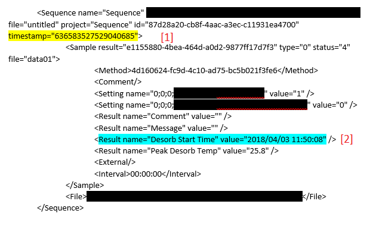

## Background

A laboratory instrument produces a log file for the analyses it
performs. The instrument may be given multiple samples to analyze. This
group of samples is called a *Sequence*. Each sequence may have one or
more *Sample Results*.

It is desirable to know both when a sequence began processing and when
an individual sample began the analysis cycle. All of this information
may be extracted from the log file.

The log file is an XML file with the appearance below. Notice that the
yellow highlighted text gives the date/time stamp of the start of the
sequence. The blue highlighted text has the date/time stamp that an
individual sample began its analysis cycle. (The black highlights are
redactions; potential file system information that his hidden for
operational security)



The log file is inconsistent, which is fortunate for us.

1.  The date/time stamp of the start of the sequence is a long string of
    numbers. It's meaning is not obvious.
2.  The date/time stamp of the start of analysis of the first sample is
    identifiable as 3 April 2018, 11:50:08.

## Objective

Determine the date/time associated with the time stamp
636583527529040685.

## Hints

-   Date/Time objects in R are, by default, stored as the number of
    seconds since 1 Jan 1970.
-   In general date times are understood as the count of some units of
    time since an epoch, or start date.
-   The time between the start of a sequence and the start of the first
    analysis is approximately equal. In other words, there should be a
    strong (and linear) relationship between the two date/time stamps.
    -   A slope will tell you something about the units being counted
        since a certain date.
    -   An intercept will tell you something about the date we are
        counting from.

After you find a slope and intercept, the function `as.POSIXct` will be
helpful in finding a solution.

## Data

Data are provided in the `Sequence.Rdata` file. The data consist of
three columns with fourteen observations.

-   `sequence_id` The identifer for the sequence.
-   `timestamp` The timestamp of the start of the sequence. While some
    of the values may appear to be identical in the display below, keep
    in mind that these are very large number, and we are only seeing the
    first 7 out of 17 digits.
-   `first_analysis` The date/time that the first analysis in the
    sequence began.

```{r, eval = FALSE}
##                             sequence_id    timestamp      first_analysis
## 1  87d28a20-cb8f-4aac-a3ec-c11931ea4700 6.365835e+17 2018-04-03 11:50:08
## 2  18b4a490-e903-4172-a794-f829a3416526 6.365835e+17 2018-04-03 11:57:27
## 3  e834936f-6f49-4d84-a3da-bf8640dfaa18 6.365836e+17 2018-04-03 14:24:44
## 4  076b7778-5922-42cb-a185-035deeb9e3a0 6.365836e+17 2018-04-03 14:39:26
## 5  5020dc7f-97a6-4276-8ce8-a2d0818cf562 6.365836e+17 2018-04-03 14:56:15
## 6  cf0f96f8-a0dd-44e9-a15d-993b7d5c1834 6.365837e+17 2018-04-03 15:40:37
## 7  e412f327-3479-4bd1-8975-7bc9c7a12042 6.365837e+17 2018-04-03 18:01:27
## 8  b0454b64-1995-4d05-8687-4164b956dda1 6.365838e+17 2018-04-03 20:20:54
## 9  d0cddbc7-4d32-488a-8952-1e5dd8b0c9e8 6.365839e+17 2018-04-03 22:40:10
## 10 f38ce43a-2203-4e49-b25e-aa9872c256ea 6.365840e+17 2018-04-04 00:58:57
## 11 5b075845-2503-470c-9127-577ba8bf7ab0 6.365843e+17 2018-04-04 10:13:14
## 12 a2133ee7-2054-401c-bae5-8c48c68c3e37 6.365844e+17 2018-04-04 11:12:44
## 13 9405e5cf-dee0-4f5d-a5b9-ae076f31b5c8 6.365853e+17 2018-04-05 12:55:39
## 14 136c6673-7256-487f-880b-f80cb399e28c 6.365853e+17 2018-04-05 13:15:36
```
You may run the following code in R to load the data into your
workspace:

```{r}
    Sequence <- 
    structure(list(sequence_id = c("87d28a20-cb8f-4aac-a3ec-c11931ea4700", 
    "18b4a490-e903-4172-a794-f829a3416526", "e834936f-6f49-4d84-a3da-bf8640dfaa18", 
    "076b7778-5922-42cb-a185-035deeb9e3a0", "5020dc7f-97a6-4276-8ce8-a2d0818cf562", 
    "cf0f96f8-a0dd-44e9-a15d-993b7d5c1834", "e412f327-3479-4bd1-8975-7bc9c7a12042", 
    "b0454b64-1995-4d05-8687-4164b956dda1", "d0cddbc7-4d32-488a-8952-1e5dd8b0c9e8", 
    "f38ce43a-2203-4e49-b25e-aa9872c256ea", "5b075845-2503-470c-9127-577ba8bf7ab0", 
    "a2133ee7-2054-401c-bae5-8c48c68c3e37", "9405e5cf-dee0-4f5d-a5b9-ae076f31b5c8", 
    "136c6673-7256-487f-880b-f80cb399e28c"), timestamp = c(636583527529040640, 
    636583532508248704, 636583620119675264, 636583629461627392, 636583639616867456, 
    636583666169027584, 636583749734024064, 636583833493856640, 636583917036381184, 
    636584000270025728, 636584333029101824, 636584368212426112, 636585295224467968, 
    636585307253700096), first_analysis = structure(c(1522770608, 
    1522771047, 1522779884, 1522780766, 1522781775, 1522784437, 1522792887, 
    1522801254, 1522809610, 1522817937, 1522851194, 1522854764, 1522947339, 
    1522948536), class = c("POSIXct", "POSIXt"), tzone = "")), class = "data.frame", row.names = c(NA, 
    -14L), .Names = c("sequence_id", "timestamp", "first_analysis"
    ))
```


# Solution

One of the hints indicates that there is a linear relationship between the sequence date/time stamp, and the first analysis. Furthermore, the slope and intercept hints lead us toward linear regression. But first, let’s convert the first_analysis column to a number.

```{r}
library(dplyr)
library(broom) # for the tidy method

Sequence <- 
  Sequence %>% 
  mutate(first_analysis = as.numeric(first_analysis))
```

Now we can fit a linear model. In this model, we will assign first_analysis to be the independent variable, and timestamp to be the dependent variable.

```{r}
fit <- lm(timestamp ~ first_analysis,
          data = Sequence)

tidy(fit) # look at the results
##             term     estimate    std.error  statistic      p.value
## 1    (Intercept) 6.213548e+17 3.575864e+12 173763.538 8.889876e-58
## 2 first_analysis 1.000070e+07 2.348184e+03   4258.907 1.891559e-38
```

What we are most interested in here are the values in the estimate column. These are the coefficients of the model, where the `(Intercept)` estimate is the y-intercept of the regression line, and the `first_analysis` estimate is the slope.

Let’s look at the slope first. Used the number of seconds since 1 Jan 1970 to be the independent variable. This means that for every one second increase in `first_analysis`, there is a corresponding increase of 10,000,698 units in timestamp. We didn’t originally know the units of timestamp, but this slope suggests that timestamp is measured in about ten millionths of a second.

Now let’s look at the intercept. With what we know already, we can determine how many years difference there are between the epoch (the date/time at which we start counting seconds) of the first_analysis and the epoch of timestamp.

```{r}
seconds_per_year <- (60 * 60 * 24 * 365.25)
# seconds / minute * minute per hour * hour / day * day / year = seconds / year

intercept <- coef(fit)[1]
intercept_seconds <- intercept / 10000000 # Divide by ten million
intercept_years <- intercept_seconds /  seconds_per_year
intercept_years
## (Intercept) 
##    1968.954
```

So it would seem that the epochs for first_analysis and timestamp are about 1969 years apart. And since the intercept is positive, we may conclude that the epoch for timestamp occurs prior to the epoch for `first_analysis`. That means the year of the timestamp epoch is

```{r}
# `timestamp` epoch
1970 - 1969
## [1] 1
```

Now we know that timestamp counts time in units of ten millionths of a second since 1 January 0001. We can convert timestamp as follows:

```{r}
as.POSIXct(636583527529040685 / 10000000,
           origin = "0001-01-01")
## [1] "2018-04-03 07:45:52 EDT"
```

and apply it to our data as follows

```{r}
Sequence <- 
  Sequence %>% 
  mutate(timestamp = as.POSIXct(timestamp / 10000000,
                                 origin = "0001-01-01"),
         first_analysis = as.POSIXct(first_analysis,
                                     origin = "1970-01-01"))

Sequence
```