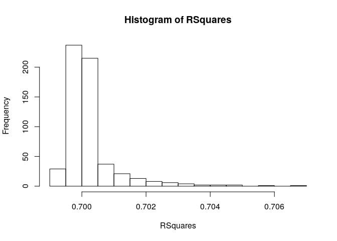
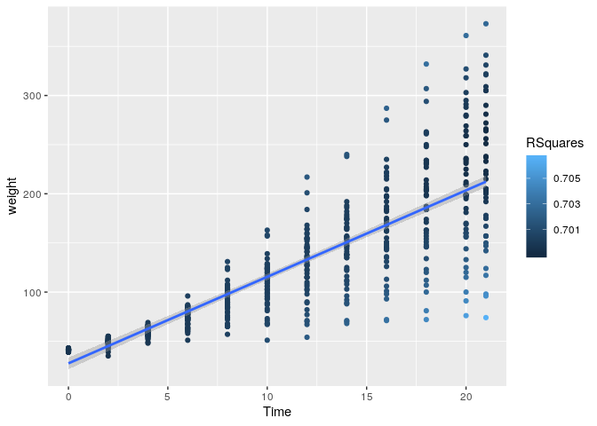

Jackknife Estimation: In statistics, the jackknife is a resampling
technique especially useful for variance and bias estimation. The
jackknife pre-dates other common resampling methods such as the
bootstrap. The jackknife estimator of a parameter is found by
systematically leaving out each observation from a dataset and
calculating the estimate and then finding the average of these
calculations. This is also known as Leave One Out Cross Validation
(LOOCV).

    ?ChickWeight
    summary(ChickWeight)

    ##      weight           Time           Chick     Diet   
    ##  Min.   : 35.0   Min.   : 0.00   13     : 12   1:220  
    ##  1st Qu.: 63.0   1st Qu.: 4.00   9      : 12   2:120  
    ##  Median :103.0   Median :10.00   20     : 12   3:120  
    ##  Mean   :121.8   Mean   :10.72   10     : 12   4:118  
    ##  3rd Qu.:163.8   3rd Qu.:16.00   17     : 12          
    ##  Max.   :373.0   Max.   :21.00   19     : 12          
    ##                                  (Other):506

We have unequal variances on the experimental “Diet” groups

We can create a linear model for the entire data set with the code

    fit <- lm(weight ~ Time, data = ChickWeight)
    fit

    ## 
    ## Call:
    ## lm(formula = weight ~ Time, data = ChickWeight)
    ## 
    ## Coefficients:
    ## (Intercept)         Time  
    ##      27.467        8.803

We could add Time|Chick to control for the intra-subject effect

We can get the R2 value with the code

    summary(fit)$adj.r.squared

    ## [1] 0.7002197

These chicks sure get bigger over time as 70% of the variance in weight
is explained by time

GOAL: Implement a jackknife procedure to produce a graphical display
(such as a histogram or boxplot) of the R2 value for the model
estimating weight as a function of time.

We need to create a loop that eliminates one row at the time, calculates
the R2 value for each of the linear models, and stores each r-squre in a
new variable that we can use to create a histogram.

    x <- 1:578
    RSquares <- numeric(length(x))

    for (i in seq_along(x)){
      Shorter <- ChickWeight[-i, ]
      fit <- lm(weight ~ Time, data = Shorter)
      RSquares[i] <- summary(fit)$adj.r.squared
    }

    RSquares

    ##   [1] 0.6996341 0.6997133 0.6998163 0.6999655 0.7001675 0.7003075 0.7004460
    ##   [8] 0.7004454 0.7002713 0.7000463 0.6996109 0.6995228 0.6995819 0.6996768
    ##  [15] 0.6998061 0.6999865 0.7001379 0.7002361 0.7002613 0.7002475 0.7000661
    ##  [22] 0.6997808 0.6994440 0.6993240 0.6996610 0.6995232 0.6997784 0.6999697
    ##  [29] 0.7001379 0.7002589 0.7003269 0.7002475 0.7000537 0.6997808 0.6996302
    ##  [36] 0.6995919 0.6996341 0.6996768 0.6997872 0.6999697 0.7001798 0.7003736
    ##  [43] 0.7005115 0.7008275 0.7005580 0.7004637 0.7007233 0.7011500 0.6996078
    ##  [50] 0.6995642 0.6997308 0.6999665 0.7001528 0.7002241 0.7002024 0.7000962
    ##  [57] 0.6999194 0.6996629 0.6993163 0.6991997 0.6996078 0.6996768 0.6998163
    ##  [64] 0.6999966 0.7001556 0.7002432 0.7002024 0.7001507 0.7001665 0.7003005
    ##  [71] 0.7007233 0.7011500 0.6996078 0.6996768 0.6997964 0.6999822 0.7001350
    ##  [78] 0.7002131 0.7002158 0.7001250 0.7001161 0.6999408 0.6998345 0.6997243
    ##  [85] 0.6996341 0.6996948 0.6998382 0.6999822 0.7001379 0.7003075 0.7003882
    ##  [92] 0.7006303 0.7008342 0.7011336 0.7023479 0.6996341 0.6997133 0.6998163
    ##  [99] 0.6999721 0.7001363 0.7002810 0.7007544 0.7013148 0.7020889 0.7027171
    ## [106] 0.7038727 0.7046799 0.6996078 0.6995940 0.6997551 0.6999650 0.7001798
    ## [113] 0.7004570 0.7007778 0.7011813 0.7017362 0.7020941 0.7026285 0.7029155
    ## [120] 0.6996610 0.6997133 0.6998620 0.7000761 0.7002774 0.7003786 0.7004185
    ## [127] 0.7001430 0.6999098 0.6998212 0.7000330 0.7004093 0.6996078 0.6996768
    ## [134] 0.6997872 0.6999650 0.7001939 0.7003614 0.7002865 0.7002859 0.7000661
    ## [141] 0.6998072 0.6996911 0.6995228 0.6996078 0.6996593 0.6997624 0.6999665
    ## [148] 0.7002588 0.7007195 0.7012817 0.7021877 0.7032195 0.7038471 0.7044964
    ## [155] 0.7048293 0.6996078 0.6996768 0.6998498 0.7000303 0.7001775 0.7002687
    ## [162] 0.7003642 0.7002987 0.7002660 0.6999061 0.6993370 0.6990643 0.6996078
    ## [169] 0.6996768 0.6997872 0.6999655 0.7002281 0.7006976 0.7014150 0.7022787
    ## [176] 0.6996078 0.6996096 0.6997361 0.6999972 0.7003620 0.7011359 0.7019021
    ## [183] 0.6996341 0.6997133 0.6998382 0.6999865 0.7001399 0.7003496 0.7005847
    ## [190] 0.7009664 0.7012654 0.7015846 0.7019242 0.7018870 0.6995565 0.6994753
    ## [197] 0.6996610 0.6996593 0.6997784 0.6999650 0.7002588 0.7006348 0.7009551
    ## [204] 0.7014560 0.7015316 0.7017177 0.7013924 0.7011500 0.6996078 0.6996422
    ## [211] 0.6997702 0.6999700 0.7002588 0.7005954 0.7010962 0.7014199 0.7018648
    ## [218] 0.7023452 0.7029213 0.7033581 0.6995819 0.6996948 0.6998498 0.7000978
    ## [225] 0.7004708 0.7008213 0.7017135 0.7015321 0.7017361 0.7017612 0.7007872
    ## [232] 0.7005839 0.6996078 0.6997922 0.6998746 0.7000154 0.7001359 0.7002894
    ## [239] 0.7004161 0.7007499 0.7006901 0.7006444 0.7005754 0.7007192 0.6996610
    ## [246] 0.6997323 0.6998382 0.6999914 0.7001359 0.7002361 0.7002289 0.7002859
    ## [253] 0.7003508 0.7002253 0.7003680 0.7004093 0.6996341 0.6997323 0.6998061
    ## [260] 0.6999966 0.7002481 0.7006976 0.7013143 0.7021429 0.7031630 0.7044441
    ## [267] 0.7056243 0.7066031 0.6995819 0.6996768 0.6998498 0.7000226 0.7001841
    ## [274] 0.7002432 0.7002158 0.7000962 0.6999194 0.6996894 0.6993370 0.6990572
    ## [281] 0.6996341 0.6996593 0.6997964 0.6999966 0.7001415 0.7002133 0.7002010
    ## [288] 0.7001582 0.6999894 0.6996300 0.6992353 0.6990093 0.6995565 0.6996256
    ## [295] 0.6998061 0.6999914 0.7001347 0.7002525 0.7003269 0.7004831 0.7003719
    ## [302] 0.7002253 0.6999257 0.6998536 0.6995565 0.6996256 0.6998061 0.6999914
    ## [309] 0.7001391 0.7002133 0.7002122 0.7001080 0.6999048 0.6996230 0.6994034
    ## [316] 0.6990880 0.6995565 0.6996593 0.6998163 0.6999966 0.7001347 0.7002241
    ## [323] 0.7002038 0.7001371 0.6999009 0.6996811 0.6996358 0.6998345 0.6996341
    ## [330] 0.6996593 0.6998163 0.6999865 0.7001363 0.7002658 0.7003269 0.7005027
    ## [337] 0.7003935 0.7005519 0.7008393 0.7014804 0.6996341 0.6997518 0.6998498
    ## [344] 0.6999914 0.7001363 0.7002411 0.7002538 0.7002475 0.6999804 0.6996343
    ## [351] 0.6992367 0.6990155 0.6996078 0.6996768 0.6998877 0.7000564 0.7002247
    ## [358] 0.7002763 0.7003073 0.7001575 0.7001617 0.7002147 0.6999096 0.6997243
    ## [365] 0.6995565 0.6996948 0.6998620 0.7000154 0.7001513 0.7002137 0.7002003
    ## [372] 0.7001836 0.7002344 0.7007085 0.7008790 0.7016292 0.6996078 0.6996768
    ## [379] 0.6998620 0.7000867 0.7002247 0.7003214 0.7003642 0.7002233 0.7004325
    ## [386] 0.7012040 0.7011609 0.7010050 0.6996078 0.6997518 0.6998746 0.7001094
    ## [393] 0.7004358 0.7007061 0.7011621 0.7014582 0.7022817 0.7030721 0.7029437
    ## [400] 0.7026955 0.6995565 0.6996593 0.6998382 0.7000087 0.7001603 0.7002154
    ## [407] 0.7002122 0.7000981 0.6999239 0.6996589 0.6992777 0.6992427 0.6996078
    ## [414] 0.6996593 0.6997872 0.6999721 0.7001488 0.7004273 0.7004944 0.7007250
    ## [421] 0.7005835 0.7003799 0.7004014 0.7003011 0.6996078 0.6996768 0.6998382
    ## [428] 0.6999966 0.7001603 0.7002164 0.7002238 0.7001158 0.6999041 0.6996983
    ## [435] 0.6996559 0.6993816 0.6996341 0.6996948 0.6998382 0.7000226 0.7001350
    ## [442] 0.7002164 0.7002152 0.7001662 0.6999804 0.6996135 0.6992665 0.6991171
    ## [449] 0.6996078 0.6997922 0.6999012 0.7000303 0.7001775 0.7002254 0.7002625
    ## [456] 0.7001828 0.7000749 0.7001907 0.7000167 0.7002132 0.6996341 0.6997133
    ## [463] 0.6999012 0.7000867 0.7001913 0.7002432 0.7002705 0.7001204 0.6999425
    ## [470] 0.6998212 0.6996109 0.6995454 0.6996341 0.6996768 0.6998620 0.7000761
    ## [477] 0.7001913 0.7002550 0.7003177 0.7001250 0.6999612 0.6997174 0.6994619
    ## [484] 0.6992295 0.6996341 0.6997922 0.6999449 0.7002352 0.7005876 0.7006845
    ## [491] 0.7007130 0.7002465 0.6999194 0.6996701 0.6996109 0.6996404 0.6996341
    ## [498] 0.6997133 0.6998877 0.7000978 0.7001913 0.7002195 0.7002289 0.7002475
    ## [505] 0.7003508 0.7007085 0.6996078 0.6996948 0.6998382 0.7000226 0.7001603
    ## [512] 0.7002172 0.7002021 0.7002134 0.7003101 0.6999871 0.6996500 0.6997431
    ## [519] 0.6995819 0.6997323 0.6998498 0.7000564 0.7001775 0.7002254 0.7002090
    ## [526] 0.7001080 0.6999562 0.6996160 0.6992473 0.6990504 0.6996078 0.6997518
    ## [533] 0.6999012 0.7000303 0.7001713 0.7002380 0.7002246 0.7001048 0.6999989
    ## [540] 0.6998072 0.6994300 0.6995228 0.6995565 0.6996948 0.6998498 0.7000385
    ## [547] 0.7001989 0.7002488 0.7002625 0.7001077 0.7001779 0.7001671 0.7002548
    ## [554] 0.7002480 0.6995819 0.6997518 0.6998746 0.7000867 0.7002343 0.7002687
    ## [561] 0.7002479 0.7000981 0.6999048 0.6996391 0.6992410 0.6990569 0.6996078
    ## [568] 0.6997717 0.6999153 0.7000761 0.7002071 0.7002334 0.7002705 0.7001305
    ## [575] 0.6999691 0.6997174 0.6993933 0.6990506

    hist(RSquares)

Why is it right skewed? Are some measures outliers and removing them
makes the R square larger? Will these “outlier” measures be all from the
same chick?

    Dataset <- ChickWeight
    Dataset$RSquares <- RSquares

    library(ggplot2)

Let’s visualize what data points have a particular strong influence in
the R square.

    ggplot(Dataset, aes(Time, weight)) + 
      geom_point(aes(colour = RSquares)) + 
      geom_smooth(method="lm", formula=y~x)

As expected, removing dots that are farther from the line result in the
R Square getting larger (clear dots farther from the line - dark dots
closer to the line).

Are the chicks in a specific diet particularly likely to be outliers?

    ggplot(Dataset, aes(Time, weight)) + 
      geom_point(aes(colour = RSquares)) + 
      geom_smooth(method="lm", formula=y~x) +
      facet_grid(~Diet)

There is a chick in Diet 2 which is not gaining enough weight when
compared to his/her peers. This chick might not look as such a big
outlier in Diet 1, where there are other chicks not gaining much weight.

If you have questions, suggestions, and/or comments about the analysis,
please contact Sara Incera at
<a href="mailto:sara.incera@eku.edu" class="email">sara.incera@eku.edu</a>
